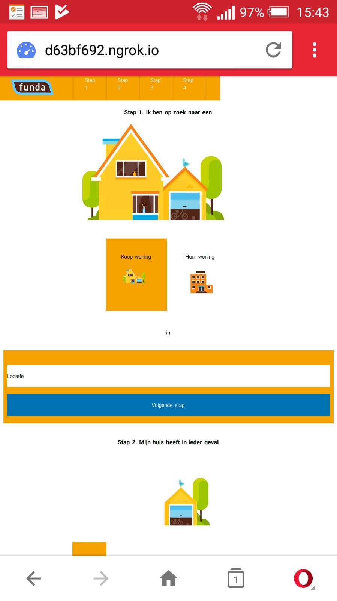

# Fork your Funda app
As an assignment for the course Browser technologies for the minor Everything Web, I forked and analyzed a project that I made in one week and made list enhancements that could make the site better.

Here is an image of the app when you enter the homescreen

## Features
Here is a list of test that I did in order to check the enhancements.  

### Disabling the images
I disabled the images to check is the site useable.

As you can see: While being disabled, it is still clear what the user can do. The images are profided with a `alt` atribute to make sure a description is shown when the image isn't.

#### To-do
- Give the user more information on the alt text [styling broken images](https://bitsofco.de/styling-broken-images/)

### Colorblindness test
In order to get a great result I searched for the most common form of colorblindness.

*There is general agreement that worldwide 8% of men and 0.5% of women have a colour vision deficiency.

The 8% of colour blind men can be divided approximately into 1% deuteranopes, 1% protanopes, 1% protanomalous and 5% deuteranomalous. Approximately half of colour blind people will have a mild anomalous deficiency, the other 50% have moderate or severe anomalous conditions.

Numbers of tritanopes/tritanomalous people and achromats is very small, perhaps 1 in 30-50,000 people.*
- [Types of colorblindness](http://www.colourblindawareness.org/colour-blindness/types-of-colour-blindness/)

I used the google plugin [Chromelens](https://chrome.google.com/webstore/detail/chromelens/idikgljglpfilbhaboonnpnnincjhjkd?utm_source=chrome-ntp-icon) to get the same results as a person who is colorblind.

**Normal**

**Deuteranomalous - Green weak(5%)**

**Protanopes - Red blind(1%)**

**Deuteranopes - Green blind(1%)**

Based on the images above I can conclude that there are no issues regarding colors.

### Screenreader
The screenreader does not have trouble going through the content. The only issue that occurs: my screenreader is english, but the content is in dutch.

### Storage
In order to disable the localStorage I used google's `Incognito mode`. This disables all cookies, storage and other type of data storage.
I noticed that my app worked perfectly.

#### To-do
- Build a server that does stores the search result into a database.

### Disabling the mouse
I disable my mouse to see if Physicaly impaired people could use the app. The <kbd>Tab</kbd> key was my friend here. While using the tab to navigate through my app I noticed that I was completely lost.

#### To-do
- A better styling for the `:focus` state.

### Disabling Javascript

By disabling Javascript I could do any API request, wich makes the app pretty much useless. The map features is very absent without Javascript.
The only way to fix this is by building a server.

#### To-do
- Build a server that does the API request.

### Device testing
This is what my app looks like on other devices

**Dell Vostro laptop**

**HTC One**

**Samsung galaxy tab s2**

**Opera mini browser**

The site does not the same on other devices as seen on the images above.

#### To-do
- Apply Feature detection.
- Apply the mobile first principle while styling the pages.

### Conclusion
In order for this app to be perfect. I need to do the following enhancements:
- Give the user more information on the alt text [styling broken images](https://bitsofco.de/styling-broken-images/).
- Build a server that does stores the search result into a database.
- A better styling for the `:focus` state.
- Build a server that does the API request.
- Apply Feature detection.
- Apply the mobile first principle while styling the pages.
