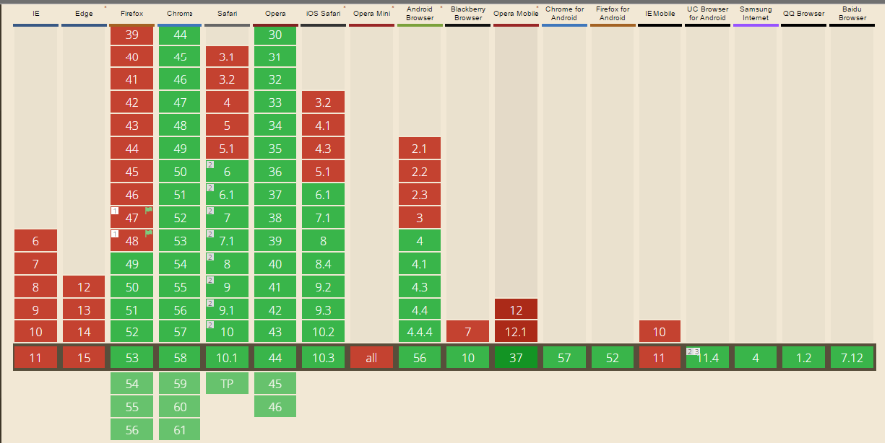

# HTML5 Detail tag

*The `<details>` element generates a simple no-JavaScript widget to show/hide element contents, optionally by clicking on its child `<summary>` element*
-[Can I Use](caniuse.com)

The basic syntax is written as follows:
```HTML
<details>
    <summary>
        This part will be shown with an arrow in front of it
    </summary>
    <p>This part will be hidden before the details element is clicked. Whenever details is clicked this will be shown. Details can also haven an open attribute, to be open as default</p>
</details>
```
this would render:
<details>
    <summary>
        Hey you there! Click me
    </summary>
    <p>Surprise</p>
</details>

### Fallback
The users clicks on a text element which opens and closes the extra information. If the browser does not support it al the text will be shown.

### Browser that can use it


As seen on the image above, using the `<details>` tag and expecting the same results on all browser is unrealistic.

### Known Issues
- In Chrome, when using the common inherit box-sizing fix [box-sizing-border-box-ftw](http://www.paulirish.com/2012/box-sizing-border-box-ftw/) in combination with a `<details>` element, the children of the `<details>` element get rendered as if they were box-sizing: content-box;. See this [Codepen example](http://codepen.io/jochemnabuurs/pen/yYzYqM)
- `<select>` within `<details>` elements won't have their value changed on the Android browser shipped with most of Samsung's devices (i.e. Note 3, Galaxy 5)
The picker will appear, but attempting to select any option won't update the `<select>` or trigger any event.

### Conclusion
Eventhough the `<detail>` tag is not supported by all browsers, it is absolutely save to use it anywhere. Because of the way that its fallback works, no content shall be hidden from the user

### Live demo
I made an example that will show the detail tag being used

View the example *Hint: try different browsers*
[Link to the example](https://eltongonc.github.io/browser-technology/feature_detection/detail-tag)
