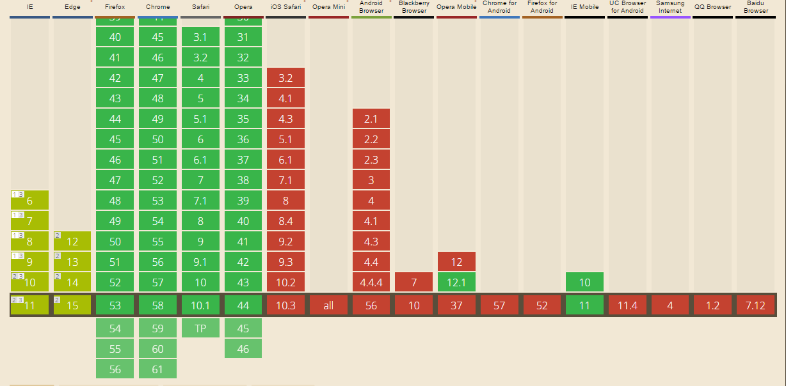

# Drag and drop

The `DragEvent` Javascript feature allows user to drag and drop content from one place to another.

```Javascript
element.addEventListener("dragstart",function(e){
    // Set the format of the data
    e.dataTransfer.setData("text/html", e.target.id);
    e.dataTransfer.setData("text/plain", e.target.id);
});

// Triggers whenever an element is above the dropzone
dropZoneElement.addEventListener("dragover", function(e){
    e.preventDefault();
    // Set the dropEffect to move. I am not sure what it does. I think it changes the cursor
    e.dataTransfer.dropEffect = "move";
});
// Triggers whenever an element is dropped in the dropzone
dropZoneElement.addEventListener("drop", function(e){
    e.preventDefault();
    // Get the id of the target and add the moved element to the target's DOM
    var data = e.dataTransfer.getData("text");
    this.appendChild(document.getElementById(data));
});
```
### Fallback
There is currently no default browser fallback. As a fallback the developer could make the elements an `<a href="#title>` and use Javascript to handle the input.  To use the drag and drop feature on a mobile use one of these js-libraries:

- [Hammer.js](http://hammerjs.github.io/)
- [Interact.js](http://interactjs.io/)


### Browser that can use it


As seen on the image above, only four browsers fully support drag and drop. Somehow only IE mobile supports drag-and-drop. Use with caution.


| IE & Edge             | Firefox, Chrome and Safari| Mobile      |
|-----------------------|---------------------------|-------------|
|Partially supported    |Fully supported            |Not supported|

### Known Issues
- In Firefox, the dragging near the edge of scrollable regions does not cause scrolling
- Reportedly, using "text/plain" as the format for event.dataTransfer.setData and event.dataTransfer.getData does not work in IE9-11 and causes a JS error. The format needs to be "text", which seems to work in all the mainstream browsers (Chrome, Safari, Firefox, IE9-11, Edge).
- Chrome strips out newlines from text/uri-list see bug
- Safari doesn't implement the DragEvent interface. It adds a dataTransfer property to MouseEvent instead. See WebKit bug #103423.
- In Safari 8, after setting event.dataTransfer.dropEffect, the value in the drop event is always 'none'
- In Firefox, the dragstart event does not fire on button elements. This effectively disables drag and drop for button elements.
- In IE9-10 draggable attribute could be effectively applied for link and image elements. For div and span elements you should call 'element.dragDrop()' to start drag event.
- In Chrome, DataTransfer.addElement is not implemented. There is no other way to implement a draggable object, that updates during the drag due to some other circumstances (e.g. changes color on a valid drop spot), as it is just a static image if addElement is not supported.


### Conclusion
Getting drag-and-drop to fully work on a site requires a lot of fallbacks. The developer should add drag-and-drop as an extra, not as a main feature.

### Live demo
I made an example that will show the drag-and-drop in action on the browsers that support. If the browser doesn't support it the sections will be expanded.

[Link to the example](https://eltongonc.github.io/browser-technology/feature_detection/drag-and-drop)

***
### Sources

- Idea from Chanel Mepschen;
- [developer.mozilla.org](https://developer.mozilla.org/en-US/docs/Web/API/HTML_Drag_and_Drop_API)
- [Can I Use](http://caniuse.com/#search=drag)
