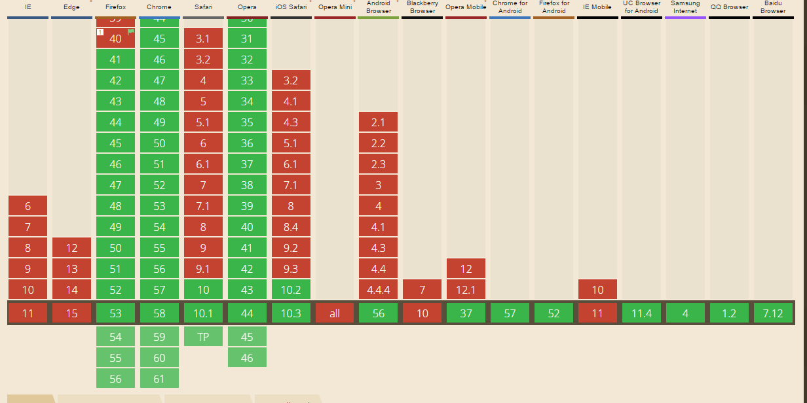

# Font loading API

The `FontFace` Javascript API feature allows user to load fonts via Javascript. After the font is done loading it can be appended to an element directly via Javascript.
This is an alternative of `@font-face`

```javascript
const font = new FontFace('name_of_font', 'url(linkToFont.woff)');
// Add the FontFace to the FontFaceSet
document.fonts.add(font);

// Load the FontFace
raleway.load();

// Wait until the font is done loading to append it to an element.
raleway.loaded.then((fontFace) => {
    // Add a class to the body element
    document.querySelector('article').classList.add('loaded-body-font');
}, (fontFace) => {
    console.error('Current status', raleway.status);
});
```

### Fallback
Because the fonts are loaded async a default font will be loaded, if `FontFace` is not supported.

### Browser that can use it


This is a features is supported by most browsers. The only browser that doesn't support this feature is the Opera mini.

### Known Issues
There are currently no known bugs according to caniuse.com

### Conclusion
It is perfectly fine to use the font-loading api. It will not have any negative impact on your site. The fallback will be the same as if you were trying to use a font that does't exist in your project.

### Live demo
I made an example that will show the async loading in action.

[Link to the example](https://eltongonc.github.io/browser-technology/feature_detection/font-loading)

***

### Sources
- [CanI Use](http://caniuse.com/#search=font%20l)
- [Article on Medium about Font loading - 4 min read](https://medium.com/@matuzo/getting-started-with-css-font-loading-e24e7ffaa791#.m7n35ysx7)
