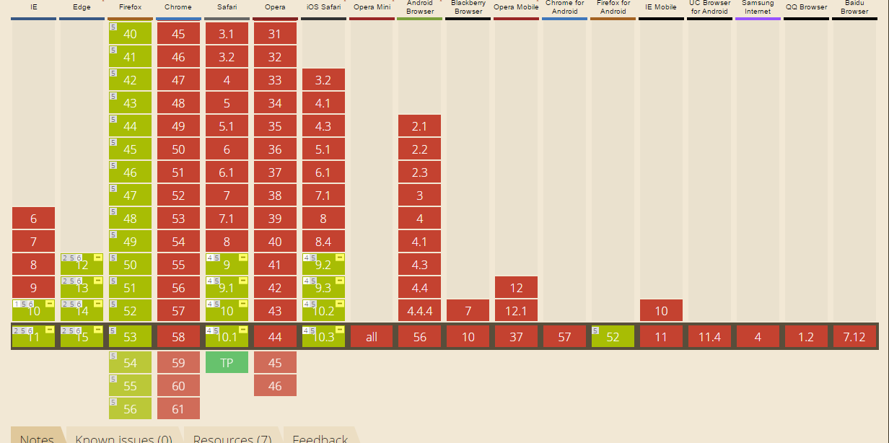

# Scroll snap Propperties

The CSS `scroll-span` feature lets the developer manipulate the way the page or content scrolls. This is useful for carrousels and other image view components.
In order to use the snap you have to set the following code:

```CSS
    .parent {
        -webkit-scroll-snap-type: mandatory;
        -ms-scroll-snap-type: mandatory;
        scroll-snap-type: mandatory;
        scroll-behavior: smooth;
        scroll-snap-destination: 0% 0%;
    }

    .children {
        -webkit-scroll-snap-coordinate: 0% 0%;
        -ms-scroll-snap-coordinate: 0% 0%;
        scroll-snap-coordinate: 0% 0%;
    }
```
### Fallback
If the browser does not support the CSS feature the page or content will scroll normal.

### Browser that can use it


This is a features that is not well supported by most browsers. The only way to support it is with a prefix. No mobile browser supports  at all.

| IE & Edge             | Firefox                   | Safar & Safari IOS |
|-----------------------|---------------------------|--------------------|
|Partially with prefix  |Partially no prefix needed |Partially with prefix, Safari 10.1 does fully support it |

### Known Issues
There are currently no known bugs according to caniuse.com

### Conclusion
using this feature can't do no harm. The fallback is always the default browser behavior, if the browser doesn't support it.

### Live demo
I made an example that will show the snapping in action on the browsers that support. If the browser doesn't support it the sections will be expanded.

View the difference on Firefox and Chrome
[Link to the example](https://eltongonc.github.io/browser-technology/feature_detection/scroll-snap)

***
### Source
- Based on [this codepen](https://codepen.io/SitePoint/pen/EPapXK/)
- [Can I Use](http://caniuse.com/#search=scroll%20sn)
