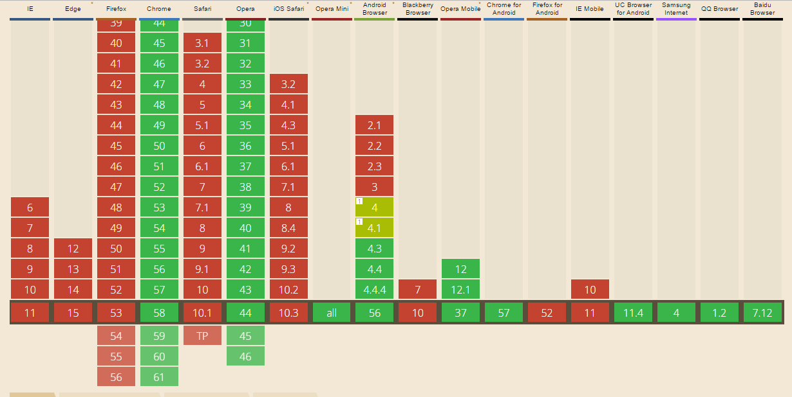

# WebP

The `picture` HTML element can contain different kind of sources, WebP is one of them. According to [developers.google.com](https://developers.google.com/speed/webp/) WebP is a lossless image format. These images are 26% smaller in size compared to PNGs. WebP lossy images are 25-34% smaller than comparable JPEG images.

```HTML
    <picture>
        <source type="image/webp" srcset="meme.webp">
        
    </picture>
```
### Fallback
The WebP file is wrapped around a picture element which has a fallback of a `img` tag. If the `source` tag is not supported the browser will load the second item in the `picture element`

### Browser that can use it


As seen on the image above this is unsupported feature for all browsers exept for chrome Andriod and Opera.

| IE, Edge, Firefox & Safari | Chrome, Andriod & Opera mini      |
|----------------------------|-----------------------------------|
| Not supported              | Fully supported                   |


### Known Issues
No Issues are know for this feature. The reason for this is because the browser has a great fallback if the images are wrapped in a `picture element`

### Live demo
[Link to the example](https://eltongonc.github.io/browser-technology/feature_detection/webp)

***
### Sources
- [developers.google.com](https://developers.google.com/speed/webp/)
